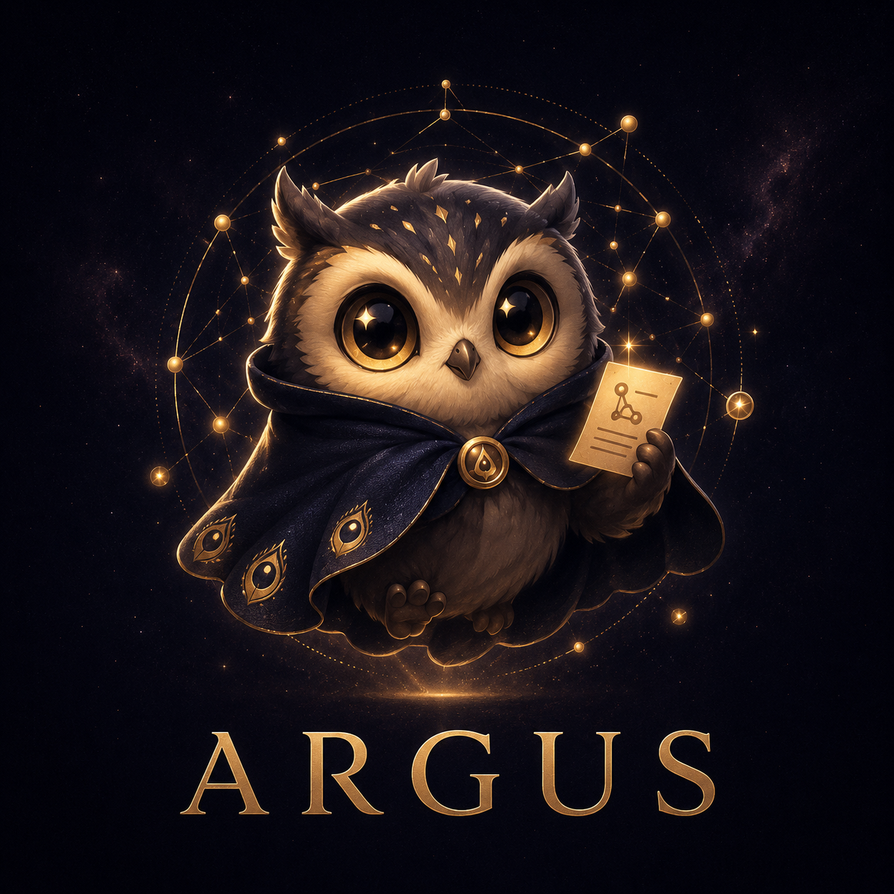
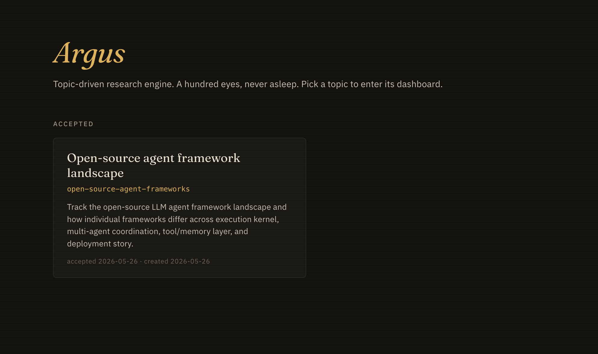
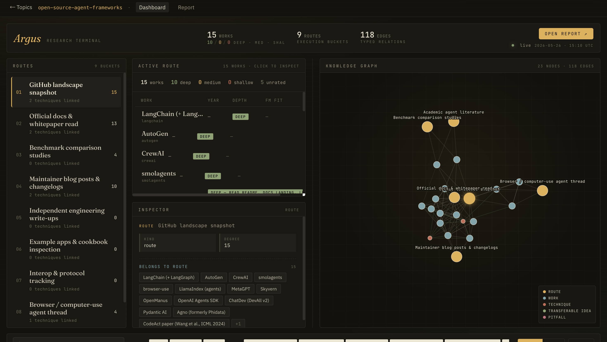
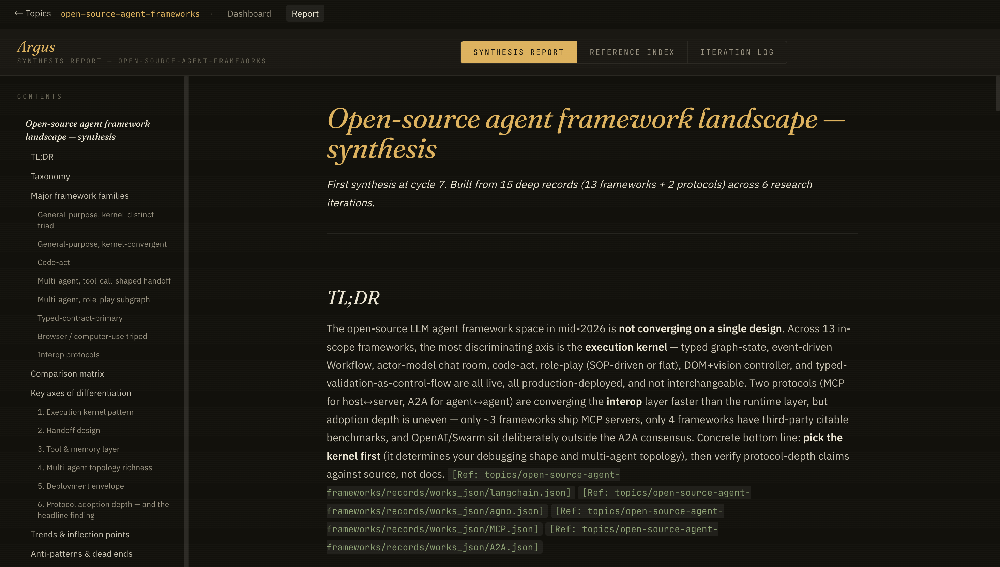

<div align="center">



# Argus

### 给那些你会反复回来的研究题目

<p>
  <b>中文</b> · <a href="README.md">English</a>
</p>

<sub>by X32 Studio</sub>

</div>

---

很多研究工具擅长回答一个问题。但真实项目往往不是一个问题。你会反复回来：新论文出来了，新项目发布了，政策变了，竞品动了，昨天的答案今天已经不完整了。

当你需要连续几天、几周盯住一个主题时，就会用到 Argus：

- 你在读论文，准备综述、论文、投资 memo 或产品判断。
- 你在看一个开源生态，想知道哪些项目真的重要。
- 你在跟踪一个行业、政策、公司，或者变化很快的技术方向。
- 你总是在问：“最近变了什么？”“我们漏了什么？”“下一步该查什么？”

你只需要用一句话告诉 Argus 主题。它会问几个问题，确认你真正关心什么，然后开始持续找资料、记住发现、更新 dashboard。

你下次回来时，不需要从零开始。你会看到它找到了什么、这些线索之间有什么关系、现在的判断是什么、还有哪里值得继续挖。

这一切被封装成**一个 Claude Code skill**。只要你有 Claude Code，就可以打开一个窗口，让 Argus 带你完成设置、dashboard 启动、研究循环和报告更新。

**Many eyes. Never asleep.**

<div align="center">
  <video src="asserts/demo.mp4" controls muted width="100%"></video>
  <br />
  <sub>如果当前平台不渲染视频，可以 <a href="asserts/demo.mp4">直接打开 demo 视频</a>。</sub>
</div>

## 认识 Argus

<div align="center">
  
</div>

## 你会看到什么

Argus 不只是一个 prompt。它会给你一个真正跑起来的研究循环，也会给这套持续积累的知识一个可视化界面。

<table>
  <tr>
    <td width="33%" align="center">
      
      <br />
      <sub><b>从一句话开始。</b><br />告诉 Argus 你想跟踪什么。它会问几个问题，然后帮你建好这个 watch。</sub>
    </td>
    <td width="33%" align="center">
      
      <br />
      <sub><b>看着领域慢慢成形。</b><br />资料不再是一堆链接，而是一张可以探索的关系图。</sub>
    </td>
    <td width="33%" align="center">
      
      <br />
      <sub><b>阅读持续更新的深度报告。</b><br />新证据进来后，报告会继续变好，并保留可检查的引用。</sub>
    </td>
  </tr>
</table>

Argus 做得可爱，是为了让长期研究这件事没那么沉重。但底层循环很执着：一百只小眼睛会持续盯住论文、仓库、政策文件、博客、新闻、帖子，以及网络上所有值得追踪的线索。

当你要的不是一段回答，而是一个之后还能继续回来的地方时，用 Argus。

## 用大白话说

- Argus 会持续帮你找这个主题下有用的资料。
- 它会把发现留下来，而不是让信息消失在聊天记录里。
- 它会把重要想法、项目、来源和关系画成一张图。
- 它会写一份解释当前局面的报告，并告诉你依据来自哪里。
- 它会发现报告里还薄弱的地方，并把这些地方变成下一轮要查的方向。

## 快速开始

你不需要自己拼 crawler、数据库、向量库、调度器和前端。安装一次 skill 之后，Argus 会在 Claude Code 里带你跑完整个流程。

### 你需要准备什么

- 已安装并登录的 **Claude Code**。
- **Git**，用来 clone 这个仓库。
- **Node.js / npm**，只给本地 dashboard 用。需要时 Argus 会帮你跑 `npm install`。

### 第 1 步：只安装一次 Argus

在普通系统终端里运行：

```bash
git clone https://github.com/X32Studio/Argus.git argus
mkdir -p ~/.claude/skills
cp -r argus/.claude/skills/argus ~/.claude/skills/argus
```

安装后，你机器上的任何 Claude Code session 都能识别 Argus。

### 第 2 步：给一个研究主题建文件夹

每个长期研究主题建议放在一个独立文件夹里。创建文件夹，并在里面打开 Claude Code：

```bash
mkdir my-watch
cd my-watch
claude
```

### 第 3 步：告诉 Argus 你想跟踪什么

下面这句话是在 Claude Code 聊天窗口里输入，不是在 shell 里输入：

```text
I want to long-term track open-source agent frameworks
```

Argus 会问几个简单问题，创建 topic 文件，启动 dashboard，然后问你要怎么运行循环。

如果你不知道选哪个，就选：

```text
Run it here in this session
```

这是新手路径。保持这个 Claude Code 窗口开着，Argus 就会持续跑研究迭代。你可以在浏览器打开 dashboard：

```text
http://localhost:5173/t/<slug>
```

`<slug>` 是 Argus 自动生成的主题短名，比如 `open-source-agent-frameworks`。

### 可选：另开一个 terminal 跑循环

只有当你想让循环单独待在另一个 Claude Code session 里，比如过夜运行时，才需要这个方式。

在第一个 Claude Code session 里，选择 **Hand off to cron via `/argus loop`** 或 **Just finish topic creation**。

然后在同一个 watch 文件夹里另开一个 terminal：

```bash
cd path/to/my-watch
claude
```

在第二个 Claude Code 聊天窗口里输入：

```text
/argus loop <slug>
```

如果这个文件夹里只有一个 accepted topic，也可以直接输入：

```text
/argus loop
```

停止循环：

```text
/argus loop stop
```

## 工作原理

```text
Skill orchestrator
  -> Iteration Runner subagent
    -> Paper Reader sub-subagents
  -> validator
  -> dashboard refresh
```

每一轮迭代结束都会跑 `validate-contract.sh --fix`。能确定修复的 schema drift 会自动修复，不能自动修复的问题会写进日志，留给下一轮处理。

每个 topic 的输出都在普通文件夹里：

```text
topics/<slug>/
├── topic.yaml
├── proposal.md
├── records/{works_json, works_md}/
├── indexes/knowledge_graph.json
├── logs/{search_log.jsonl, research_state.md, cycle.txt, orchestrator.jsonl}
└── report/{main.md, reference_index.md, iteration_log.md}
```

## 仓库结构

```text
.claude/skills/argus/          # canonical engine source
├── SKILL.md                   # front door + orchestration loop
├── docs/                      # schema contract and plans
├── scripts/                   # bootstrap, refresh, validation
└── templates/                 # source templates copied into a watch directory

app/                           # dashboard source
asserts/                       # README images, prompt notes, demo video
```

修改引擎逻辑时，优先改 `.claude/skills/argus/templates/`，然后运行 `bash .claude/skills/argus/scripts/bootstrap.sh` 同步到运行目录。

## 状态

目前适合个人长期研究和情报跟踪使用。引擎本身不绑定领域；仓库里的示例只是展示，不是重点。

维护者：**k-x32**。Fork 之后运行 `/argus init "<your topic>"` 就可以开始。

<div align="center">
  <sub>A hundred eyes. Never asleep.</sub>
</div>
